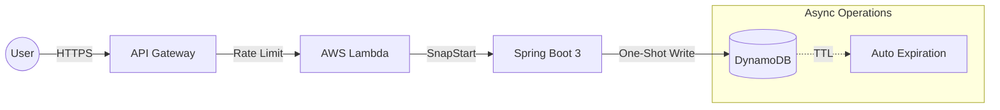

<div align="center">

# URL Shortener V2
### Serverless Enterprise Edition


> **A high-performance, scalable, and secure URL shortening system, designed with a Serverless architecture on AWS.**

</div>

---

# About the project

This project goes beyond a simple URL shortener. It was built as a showcase of **modern Software Engineering** practices, combining high performance, low latency, and strong **FinOps principles** to achieve real **cloud efficiency**.

The system was fully migrated from a traditional monolithic architecture to a **Serverless design using AWS Lambda**, eliminating idle infrastructure costs and enabling the application to scale automatically as traffic increases — without worrying about servers or capacity.

---

# Solution Architecture

## Architecture Diagram


## Technical Highlights
| Feature | Description |
|--------|-------------|
| **Zero Cold Start** | AWS SnapStart reduces JVM startup from ~6s to <500ms. |
| **One-Shot Optimization** | Fetches the URL and increments analytics in a single database round-trip. |
| **NoSQL Persistence** | Schemaless design ensures extreme I/O performance in DynamoDB. |
| **Hashids & Security** | Prevents ID enumeration and produces safer, obfuscated short codes. |
| **FinOps (TTL Cleanup)** | Automatic expiration of URLs with zero compute cost. |
| **Distributed Locking** | Optimistic Locking ensures uniqueness of custom aliases. |
| **DDoS Protection** | Rate limiting and throttling configured directly in API Gateway. |

---

## Tech Stack

- **Language:** Java 21 (LTS)  
- **Framework:** Spring Boot 3  
- **Cloud:** AWS Lambda, API Gateway, DynamoDB  
- **IaC:** AWS SAM  (Serverless Application Model)
- **CI/CD:** GitHub Actions  
- **Libraries:** Hashids, AWS SDK v2, Lombok  

---

#  Running the Project Locally

## Prerequisites
Before running, ensure you have the following installed:
- Java 21+
- Maven
- Docker (Required for SAM local)
- AWS SAM CLI

## Configuration (Environment Variables)

This project uses **Hashids** for security, requiring a Secret Salt. To run locally, you must configure it.

1.  Create a file named `env.json` in the root directory.
2.  Add your local secret key:

```json
{
  "UrlShortenerFunction": {
    "HASH_SALT": "PUT_YOUR_LOCAL_SECRET_KEY_HERE"
  }
}
```

## **1. Clone and Build**

```bash
git clone https://github.com/YOUR-USER/url-shortener-v2.git
cd url-shortener-v2

# This compiles the code and prepares the SAM template
sam build
```

## 2. Run Unit Tests (Recommended)
The project includes comprehensive unit tests validating the logic (Hashids, collision handling, etc.)

```bash
mvn test
```

## 3. Start Local API (Docker)
Note: To fully simulate the database connection, ensure you have AWS credentials configured locally or a local DynamoDB instance.

```bash
sam local start-api
```

The API will be available at: http://127.0.0.1:3000

---

# API Documentation 
### 1. Create Short URL

**POST** `/shorten`

Payload (JSON):

```json
{
  "originalUrl": "https://www.linkedin.com/in/your-profile",
  "customAlias": "my-linkedin",
  "expirationTime": 1735689600
}
```

Notes: 
- customAlias and expirationTime are optional.

Responses:

| Status                    | Meaning                        |
| ------------------------- | ------------------------------ |
| **201 Created**           | Successfully created short URL |
| **409 Conflict**          | Custom alias already taken     |
| **429 Too Many Requests** | Rate limit exceeded            |

### 2. Redirect 
  **GET** `/{shortCode}`

- Returns 302 Found and redirects the user to the original URL while asynchronously tracking the click..

---

## 4. Deployment & CI/CD
```bash
sam deploy --guided
```

SAM will automatically provision:
- DynamoDB tables (with TTL enabled)
- Lambda functions (with SnapStart)
- IAM roles
- API Gateway (with Throttling)

### CI/CD Automation (GitHub Actions)
The workflow file: .github/workflows/pipeline.yml handles the CI/CD:
- CI: Run maven build + Unit tests on every push.
- CD: Deploys to AWS only if tests pass.

---

# Author
Developed by **Matheus de Sousa Almeida**

[](https://www.linkedin.com/in/matheus-de-sousa-almeida-143419261/)
